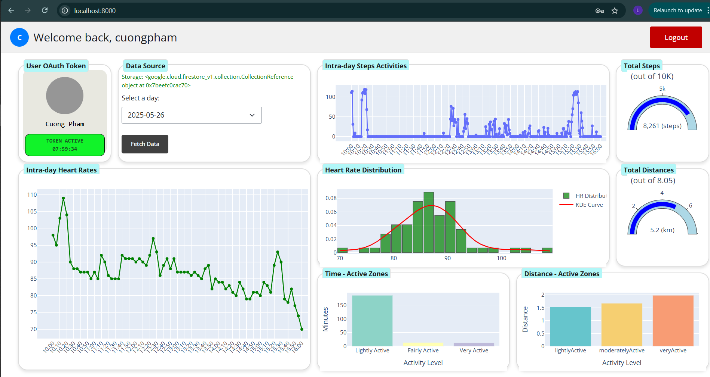

# fitbit-visualize-shiny
Data Visualization Course at VinUni. Using Python + Shinny Dashboard

## 1. Introduction
- This study employs a Python-based Shiny application that integrates Fitbit data visualization through a user-authenticated dashboard. Highlight features:
    - Integrates Fitbit data from Firebase.
    - Renders multiple interactive visualizations using Plotly and Matplotlib in a grid layout.
    - Enables user-specific data exploration (e.g., by day selection).

## 2. Methods

### 2.1. System Setup
- **API**: The project utilizes the official *Fitbit Web API* to access the user’s wearable data. Data endpoints include activity metrics, heart rate, steps, etc. 
- **OAuth 2.0 Authentication**: Access to the Fitbit data API is secured via *OAuth 2.0* authorization protocol. The system handles token management, including obtaining initial access tokens via manual process, ensure user privacy and data security.
- **Data Storage and Management**: Collected personal Fitbit data, then stored securely on *Google Firebase*, where it will be organized and indexed to support efficient querying

### 2.2 Data Visualization
- Some plots includes:
    - Line plots: Created using Matplotlib or Plotly to visualize time-series data for steps and heart rates.
    - Gauge plots: Plotly indicators represent total daily steps or distances compared to goals (e.g., 10K steps or 8.05 km).
    - Bar plots: Visualize categorical distributions such as active minutes and distances by zone.
    - Histograms: Show heart rate distribution for the selected day

- Key visualization metrics: 

| Box | Title                     | Data Source              | Visualization        |
|-----|----------------------------|--------------------------|----------------------|
| 1   | User OAuth Token           | User credentials         | Authentication info  |
| 2   | Data Source                | Firebase, user choices   | Data summary         |
| 3   | Intra-day Steps Activities | Intraday time-series     | Line plot            |
| 4   | Total Steps                | Daily summary            | Gauge plot           |
| 5   | Intra-day Heart Rates      | Intraday heart rate      | Line plot            |
| 6   | Heart Rate Distribution    | Heart rate summary       | Histogram            |
| 7   | Total Distances            | Daily summary            | Gauge plot           |
| 8   | Time - Active Zones        | Active minutes summary   | Bar chart            |
| 9   | Distance - Active Zones    | Activity distances       | Bar chart            |

## 3. Experiment
- **Duration & Period:** The data collection experiment was conducted over a two-week period from **May 15th to May 31st, 2025**.
- **Participants:** This initial pilot involved 1 user (me) who actively wore the Fitbit device during daytime hours.

